# Suricata Detection Lab - Cross-Segment IDS auf pfSense

Aufbau einer netzwerkbasierten Intrusion-Detection-Strecke auf einem bestehenden
segmentierten pfSense-Lab. Ein verwundbarer Webdienst (DVWA) wird aus einem
nicht vertrauenswürdigen Segment angegriffen; Suricata inspiziert den
Cross-Segment-Traffic. Dokumentiert sind drei Detection-Fälle sowie das
eigenständige Schließen einer Detection-Lücke durch eine selbst geschriebene
Custom-Signatur.

Dieses Lab baut auf [`pfsense-segmentation-lab`](#) auf und ergänzt die
defensive/Blue-Team-Seite: Erkennung statt nur Segmentierung.

---

## Ergebnis!

- **Funktionierende Cross-Segment-Detection-Pipeline auf bestehender Segmentierung**
- **Drei dokumentierte Detection-Fälle: Recon (nmap), Scanner (nikto),
  SQLi-Angriff (sqlmap)**
- **Eigenständig diagnostizierte Detection-Lücke (ET Open vs. konkretes
  UNION-SELECT-Muster)**
- **Eigene Suricata-Signatur geschrieben, debuggt und verifiziert**

---

## Topologie

Alles virtuell auf einem Host (KVM/QEMU), pfSense als VM mit vier libvirt-Netzen.

| Segment    | Subnetz          | Rolle                                        |
|------------|------------------|----------------------------------------------|
| GUEST      | 10.10.20.0/24    | Angreifer (Kali, 10.10.20.100)               |
| PRODUCTION | 10.10.40.0/24    | Ziel (Ubuntu Server + DVWA, 10.10.40.100)    |
| MGMT       | 10.10.50.0/24    | Management                                   |

Suricata läuft auf dem **PRODUCTION-Interface** (vtnet3) im **IDS-Modus**
(Alert-only, kein Blocking). Begründung: Überwacht wird die schützenswerte Zone,
nicht die Quelle. Der Angriff GUEST → PRODUCTION überquert zwingend die pfSense
und wird dort inspiziert.

> **Hinweis zum Realismus:** In einer Produktivumgebung käme ein Angreifer auf
> einen exponierten Webdienst aus einem Internet-facing-Segment oder einer DMZ,
> nicht aus dem Gästenetz. Die Quell-Zone GUEST ist eine Lab-Vereinfachung; die
> Detection-Logik ist davon unabhängig identisch.

---

## Aufbau

### 1. Firewall - eng gefasste Ausnahme bei intaktem Implicit Deny

Der Angriffspfad erfordert genau einen Pfad durch die Segmentgrenze. Statt GUEST
breit nach PRODUCTION zu öffnen, wurde eine minimale Ausnahme geschnitten:
ein einzelner Host, ein einzelner Port.

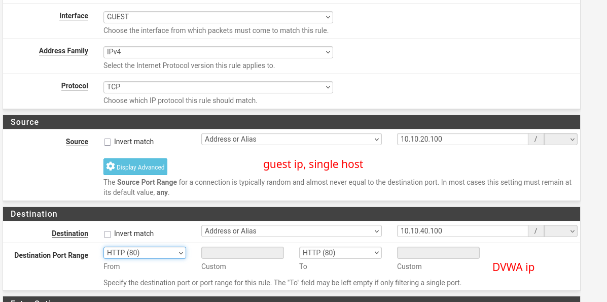

- **Pass:** GUEST-Host 10.10.20.100 → 10.10.40.100, **nur TCP/80**
- Das restliche Implicit Deny zwischen den Segmenten bleibt unberührt.
- Regelreihenfolge beachtet (first match wins): Die Pass-Regel steht **über** den
  bestehenden Block-Regeln, sonst würde der Block zuerst greifen.

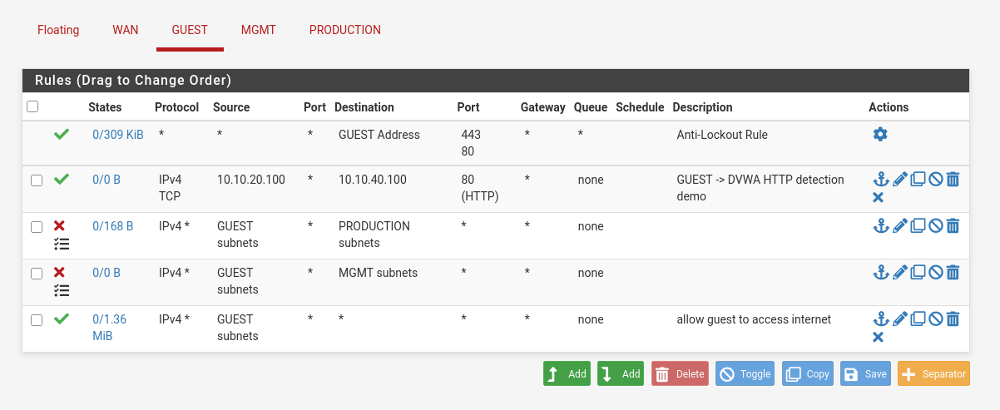

Zusätzlich wurde PRODUCTION ausgehend abgesichert (war zuvor vollständig
Default-Deny, ohne Internetzugang):

- **Block:** PRODUCTION → GUEST und PRODUCTION → MGMT (Lateral Movement verhindern)
- **Pass:** PRODUCTION → any (kontrollierter Internetzugang, für Paket-/Image-Pull)

Konstruktion: Lateral-Block vor breitem Internet-Pass. Unerwünschte interne Ziele
werden vor dem erlaubenden Pass abgefangen. Prinzip „Lateral Movement verhindern".

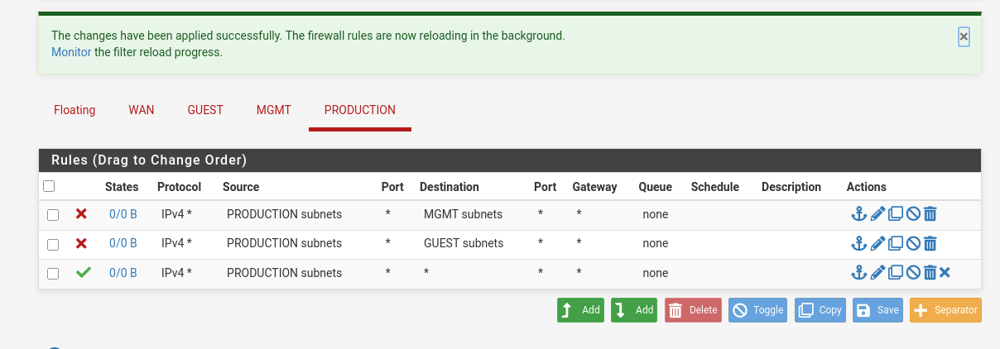

### 2. Verwundbares Ziel

Ubuntu Server in PRODUCTION (10.10.40.100, per DHCP von pfSense).

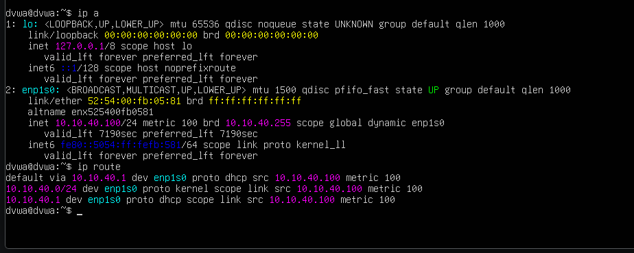

DVWA als Docker-Container, reproduzierbar und wegwerfbar. Das Port-Mapping
`-p 80:80` macht DVWA auf 10.10.40.100:80 erreichbar, genau die Adresse, die die
Firewall-Ausnahme adressiert:

```bash
sudo docker run -d -p 80:80 --name dvwa vulnerables/web-dvwa
```

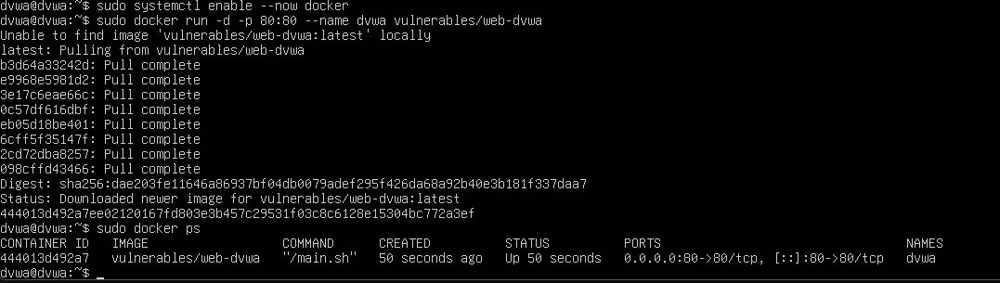

Erreichbarkeit aus Kali bestätigt, Cross-Segment-Zugriff funktioniert:

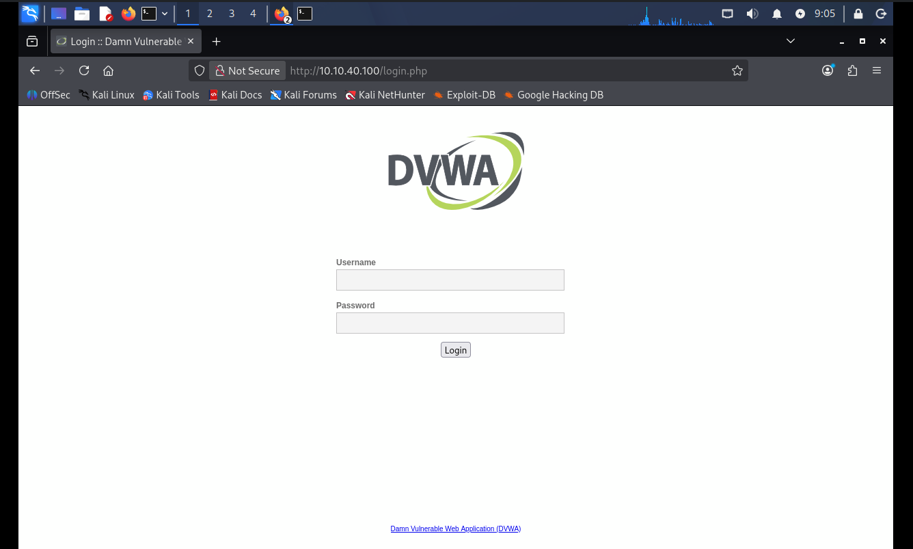

### 3. Suricata

Package auf pfSense installiert, Interface PRODUCTION, IDS-Modus.

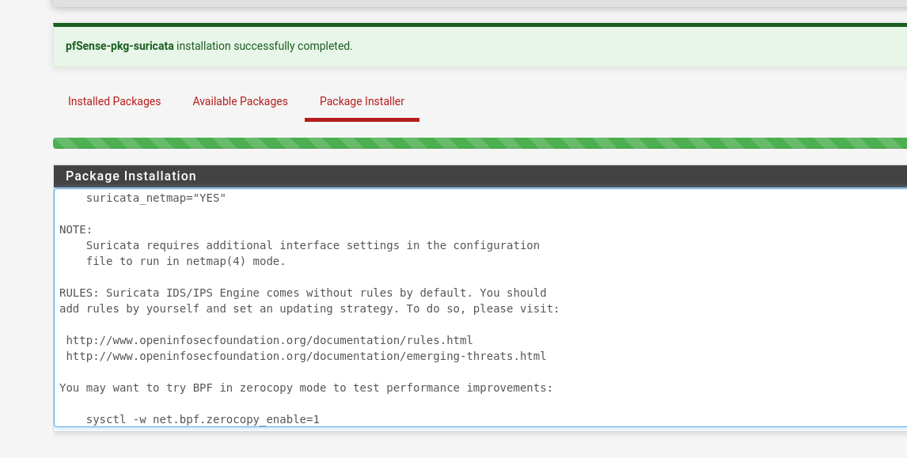

Regelset: **ET Open** (Emerging Threats Open). pfSense weist selbst darauf hin,
dass die Abdeckung begrenzter ist als ETPro. Ein Punkt, der später relevant wird:

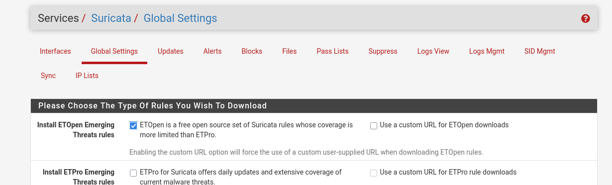
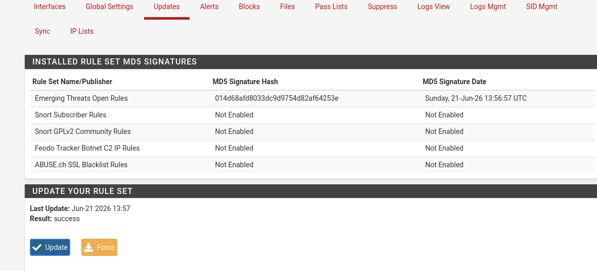

Hardware Offloading (Checksum/TSO/LRO) wurde deaktiviert bei virtuellen NICs, sonst sieht Suricata unvollständige Pakete. Interface läuft, Blocking
ist DISABLED (reiner IDS-Modus):

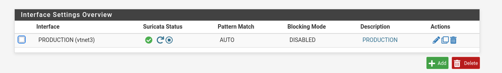

---

## Detection-Fälle

### Fall 1 - Recon (nmap)

Ein voller Scan scheitert zunächst an der Firewall. nmaps Host-Discovery (ICMP)
wird durch die Least-Privilege-Regel (nur TCP/80) geblockt, ein Ping zum Ziel
bleibt unbeantwortet, der Host erscheint als „down".

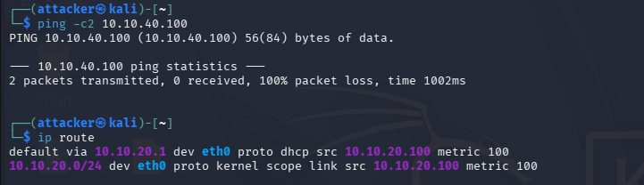
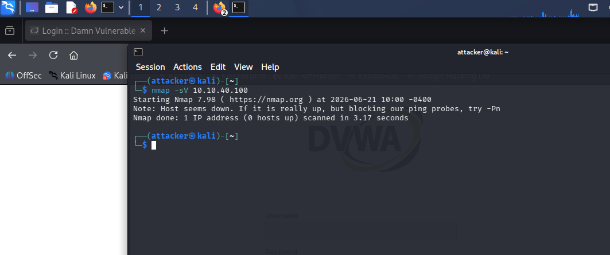

`-Pn` überspringt die Host-Discovery, `-p80` zielt auf den erlaubten Port, der
Scan kommt durch und identifiziert Apache 2.4.25:

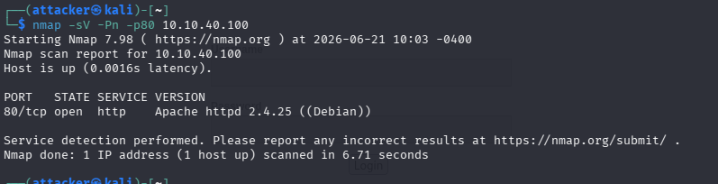

Suricata-Alert: **`1:2024364 ET SCAN Possible Nmap User-Agent Observed`**
(Kategorie `emerging-scan.rules`). Die Regel matcht auf `http.user_agent` mit
`content:"|20|Nmap"` - Erkennung erfolgt also auf Layer 7 am User-Agent des
HTTP-Probes, nicht über klassische Port-Scan-Heuristik. Das ist der Grund, warum
selbst der Single-Port-Scan erkannt wird.

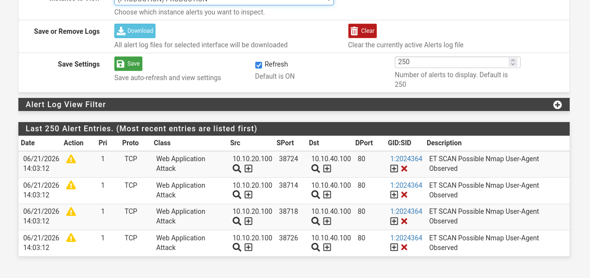

### Fall 2 - Web-Vulnerability-Scanner (nikto)

```bash
nikto -h http://10.10.40.100
```

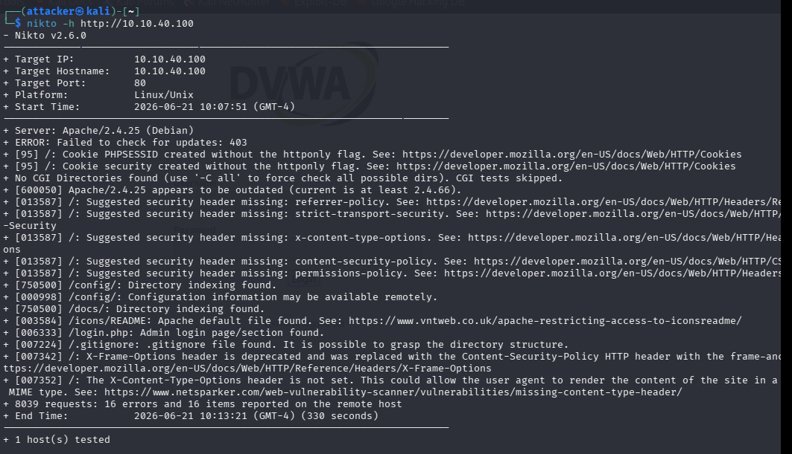

Erzeugte ein breites Alert-Spektrum in drei Kategorien:

- **Web-Attack (Pri 1):** ColdFusion-, WordPress-Plugin-Probes (ET WEB_SERVER /
  WEB_SPECIFIC_APPS). Hinweis: DVWA betreibt diese Software nicht - Suricata
  alarmiert auf den *Versuch* im Traffic, unabhängig vom Erfolg am Ziel.
- **Protokoll-Anomalien (Pri 3):** SURICATA-eigene Erkennung fehlerhafter
  HTTP-Requests (ambiguous/invalid Host header).
- **Info (Pri 3):** Spring-Boot-Actuator-Probe.

SOC-Einordnung: kein gezielter Einzelangriff, sondern eine Quelle, die in Sekunden
viele Web-Probes feuert = automatisierter Scanner. Die Ereignisse wurden per Alert-Korrelation zu einem einzelnen Incident zusammengefasst.

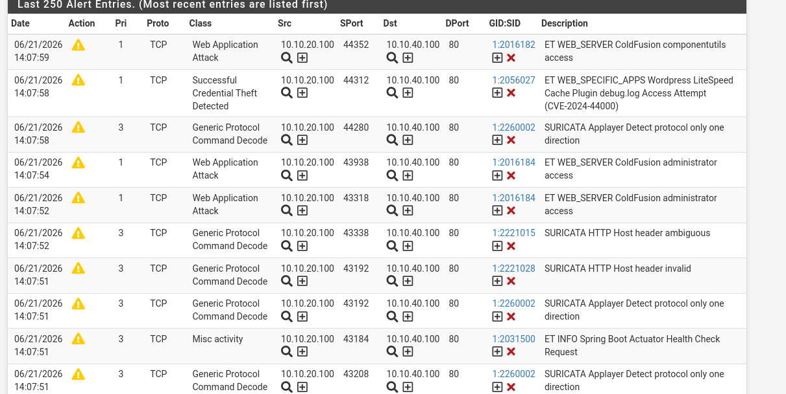

### Fall 3 - Gezielte SQL-Injection (sqlmap)

```bash
sqlmap -u "http://10.10.40.100/vulnerabilities/sqli/?id=1&Submit=Submit" \
  --cookie="PHPSESSID=<session>; security=low" --batch --dbs
```

Der `id`-Parameter ist über vier Techniken injizierbar (boolean-based, error-based,
time-based, UNION query); ausgelesen wurden Backend (MySQL/MariaDB), Webserver
(Apache 2.4.25) und OS (Debian 9). sqlmap meldete in der Heuristik zusätzlich eine
mögliche XSS-Anfälligkeit des Parameters. Nicht weiterverfolgt, da der Fokus auf
SQLi-Detection lag.

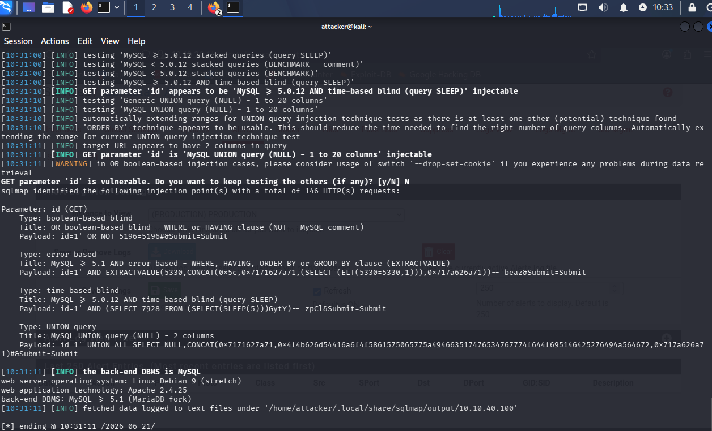

---

## Detection-Lücke und Custom-Signatur

**Befund:** Der erfolgreiche sqlmap-Angriff (146 HTTP-Requests mit SQLi-Payloads)
erzeugte **keinen** SQL-Injection-Alert, obwohl Suricata den Traffic sah (nmap
feuerte parallel weiterhin - Pipeline intakt).

**Ursache:** Keine der aktiven ET-Open-Regeln passte
auf dieses konkrete Angriffsmuster:

- Die `emerging-sql`-Regeln zielen auf **direkten Datenbank-Traffic**
  (`$SQL_SERVERS`, Port 1433/3306) - nicht auf SQLi in HTTP-Parametern auf Port 80.

  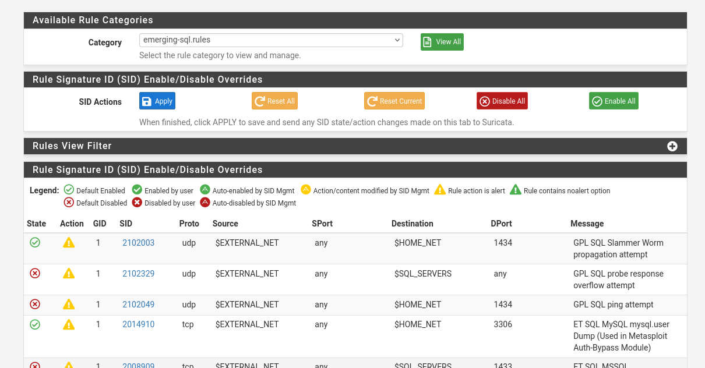

- Es existieren zwar generische SQLi-Web-Regeln (`ET WEB_SERVER SQLi`,
  `ATTACKER SQLi`), doch sie matchen auf andere Muster (`SELECT and sysobject`,
  `Schema Columns`) bzw. sind teils default-disabled - keine fing das konkrete
  `UNION SELECT` im HTTP-URI ab.

  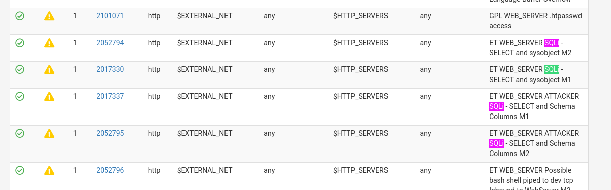

Das ist eine reale Abdeckungsgrenze des Open-Sets gegen generische Web-SQLi
(ET Open weist selbst auf die begrenzte Coverage hin), kein Konfigurationsfehler.

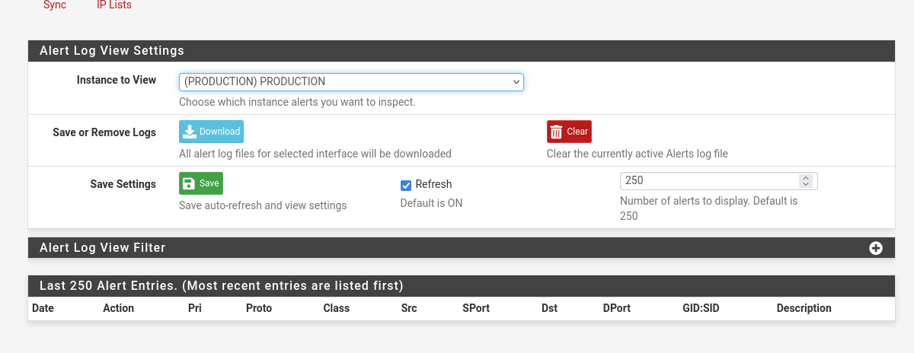

**Lösung - eigene Signatur** (`custom.rules`):

```
alert http any any -> $HOME_NET any (msg:"LOCAL SQLi UNION SELECT detected in HTTP request"; flow:established,to_server; http.uri; content:"UNION"; nocase; content:"SELECT"; nocase; distance:0; classtype:web-application-attack; sid:1000001; rev:1;)
```

Logik: Alarm bei etabliertem HTTP-Request zu `$HOME_NET`, wenn der URI `UNION`
gefolgt von `SELECT` enthält (case-insensitive, `distance:0` erlaubt
`UNION ALL SELECT`). Das Muster kommt in legitimen Requests praktisch nie vor →
geringe False-Positive-Rate. SID 1000001 (lokaler Bereich ≥ 1000000).

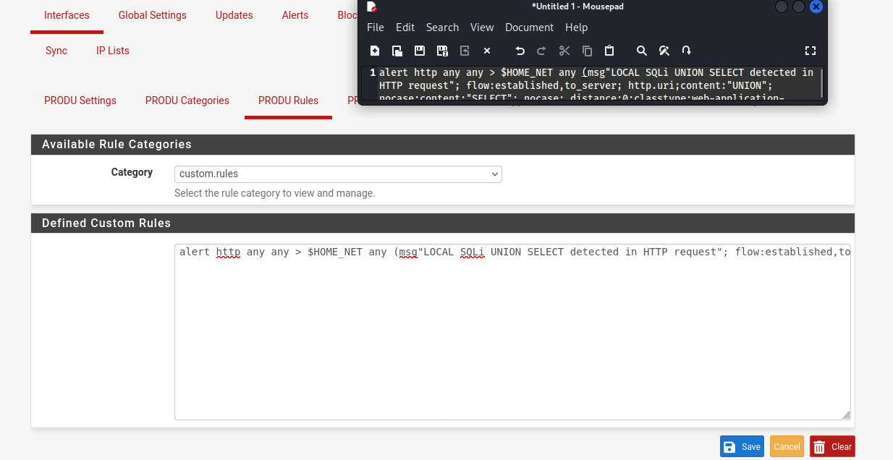

**Debugging:** Die erste Version ladete nicht. Vorgehen:

1. curl-Test mit garantiert lesbarem Payload schloss ein Kodierungsproblem aus.
2. Das Startup-Log (`suricata.log`) zeigte zwei Parse-Fehler: `>` statt `->` als
   Richtungsoperator, sowie fehlender `:` nach `msg`.
3. Nach Korrektur lädt die Regel sauber (Fehlerzeile verschwunden)

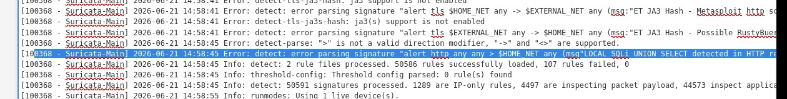

**Verifikation** mit garantiert lesbarem Payload:

```bash
curl "http://10.10.40.100/vulnerabilities/sqli/?id=1+UNION+SELECT+1,2&Submit=Submit" \
  --cookie "PHPSESSID=<session>; security=low"
```

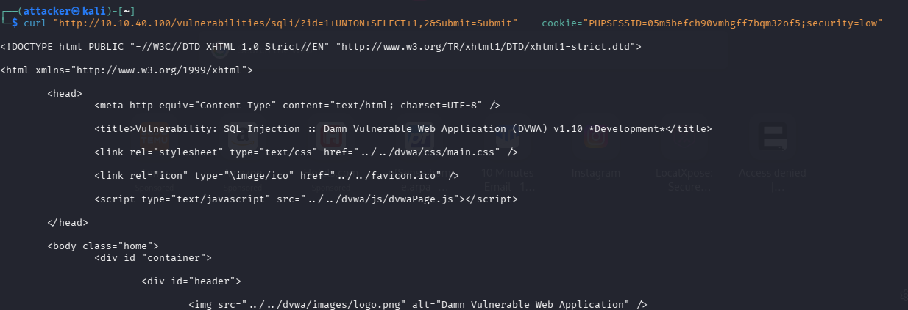

**Ergebnis:** Die eigene Signatur feuert zuverlässig -
**`1:1000001 LOCAL SQLi UNION SELECT detected in HTTP request`**:

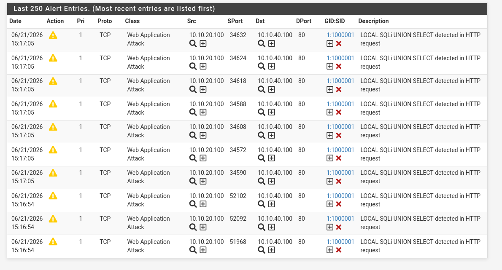
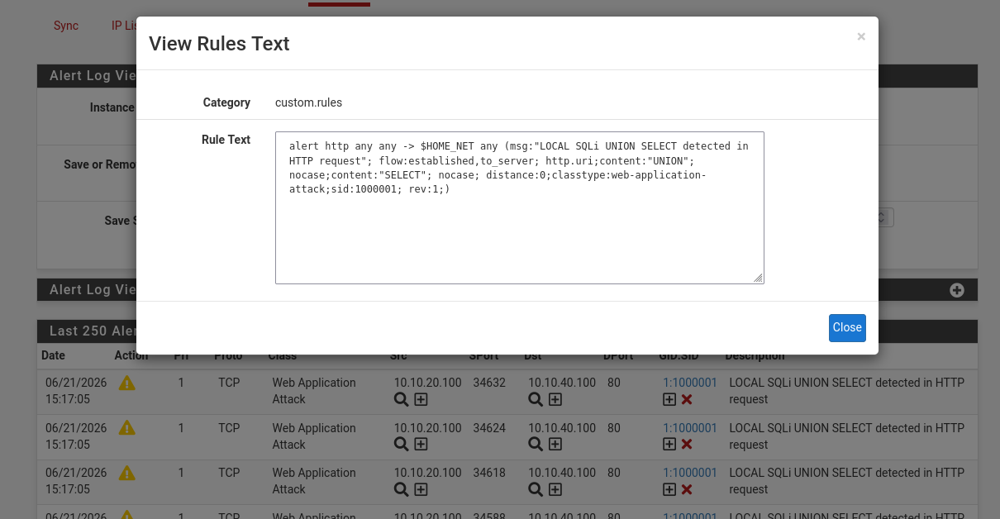

**Grenzen der Signatur (bewusst):** Sie deckt die UNION-based-Variante ab.
Error-based (`EXTRACTVALUE`), time-based (`SLEEP`) und boolean-based (`OR NOT ...`)
enthalten kein `UNION SELECT` und würden weitere custom Signaturen erfordern. Eine treffsichere Regel wurde einer überladenen mit False-Positive-Risiko
vorgezogen.

---

## Technische Schwerpunkte

- Firewall (pfSense, Least-Privilege-Regeln, Lateral-Movement-Block) ·
- IPS/IDS (Suricata, Interface-Platzierung, Regelkategorien) ·
- Detection Engineering (Signatur-Aufbau, Custom-Rule, Troubleshooting via Engine-Log) ·
- Angreifer- und Verteidigerperspektive im selben Artefakt